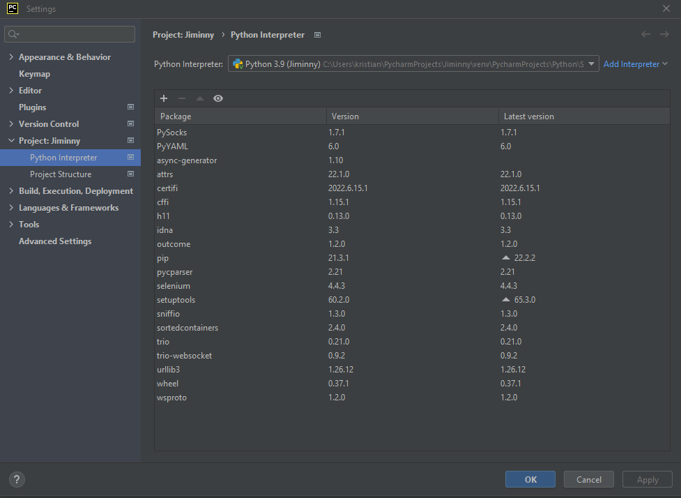
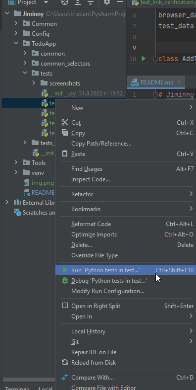

# Jiminny

### Writen in python3
### Used framework for testing: PyUnit
### Used framework for automation: Selenium

## Description
#### - This is small automation test infrastructure witch is used to test the Todo App
##### - In Common folder tou can find base functionality witch used to navigate, click, enter text in some field etc… and also browser setup(The setup is made to run for two browsers Chrome and Firefox)
##### - In Config folder browser_config.yaml we can change the main browser and url witch tests are using
##### - In TodoApp you cn find common and common_selectors witch are used to create some functionality for the specific pages. The tests are stored in folder tests and the test data used for them is stored in test_data. Screenshots folder is used to store screenshot from failed tests.
##### - In Tools are stored custom tools like yaml and text reader(email or db connection sender can be added etc...) to avoid duplicating the code in the tests
## Steps to run the tests:
##### Install python3: https://www.python.org/
##### Install PyCharm Community Edition IDE: https://www.jetbrains.com/pycharm/
##### - Open the project in PyCharm
##### - The ide should detect the missing packages and will ask you to add them
###### --> if not, you can use python interpreter and add them manually from File>Settings>PythonInterpreter
###### --> if not, you can use the terminal: pip install <name_of_the_package>
###### --> all needed packages are on the picture below.

##### - You should be able to run the test when simply pre mouse right click and Run

##### - Or you can enter command into the terminal: python <file_path>
###### --> NOTE: running the test from the terminal cause issue with the import for some reason, and you may not be able to run the test so i suggest using the firs approach!

